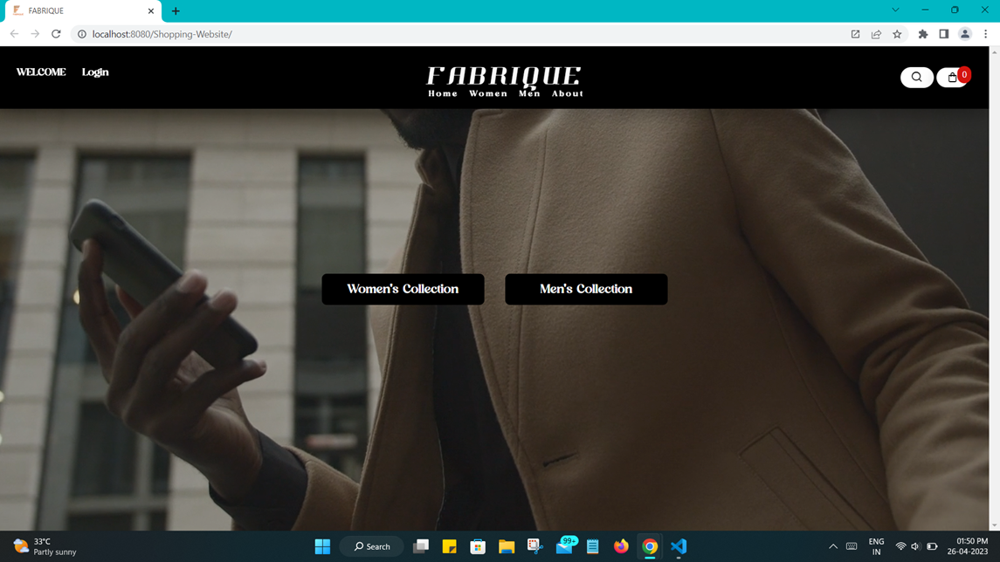
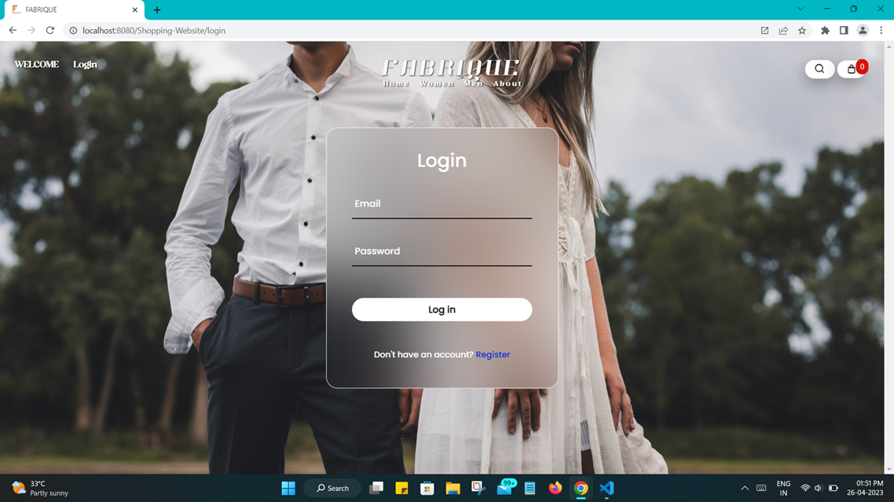
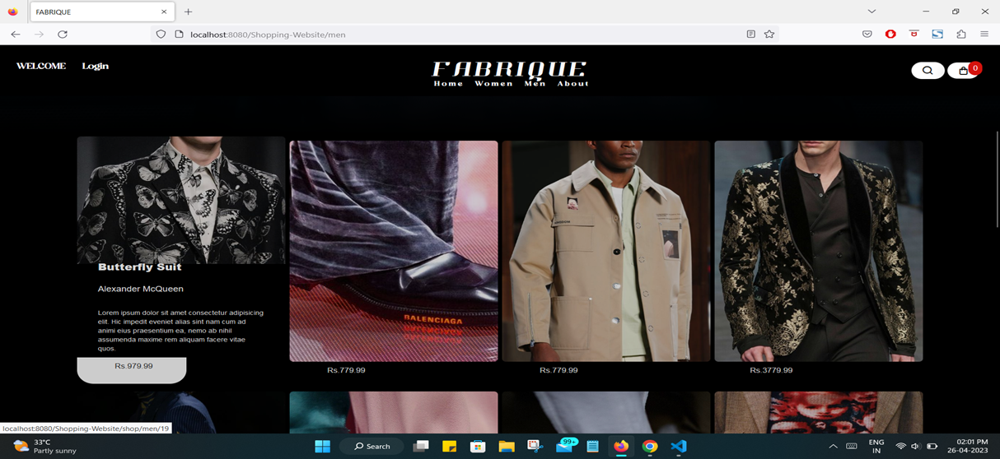
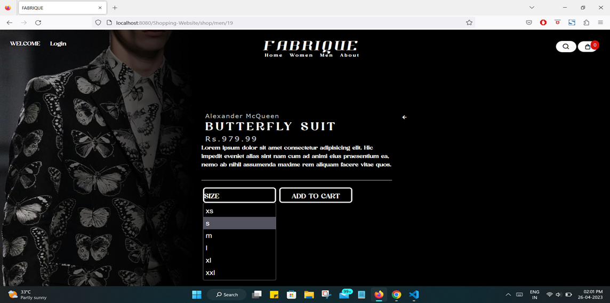
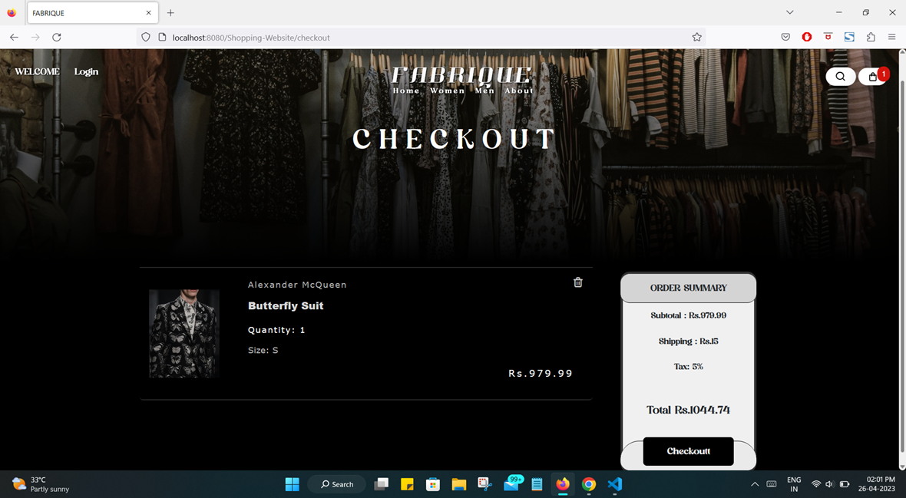
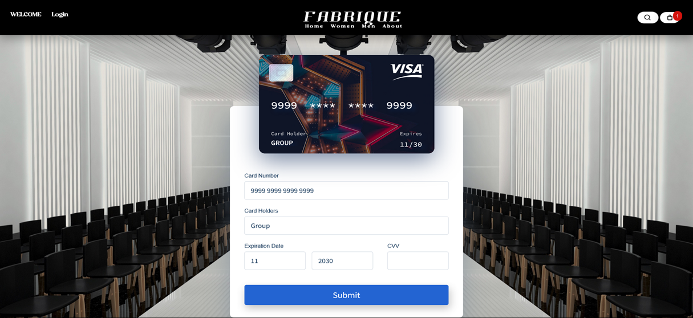
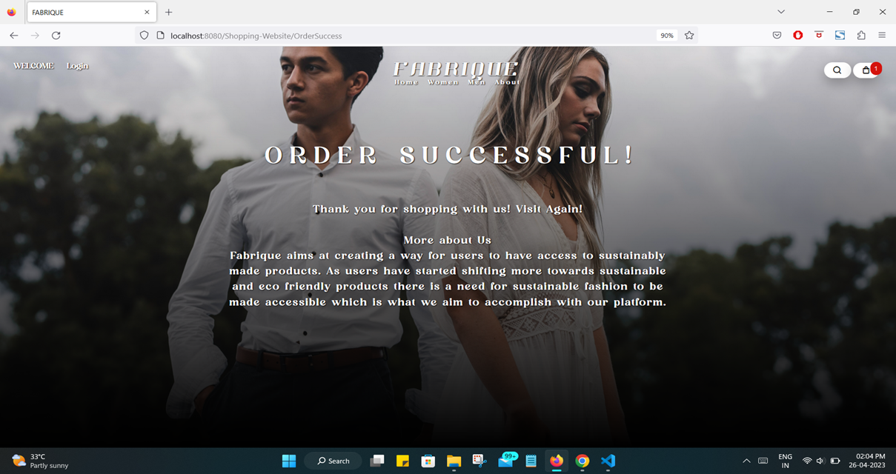
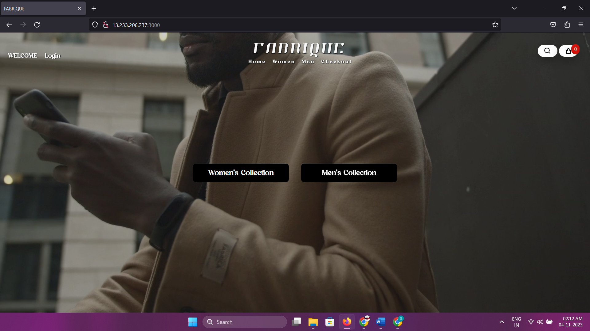

# Vue.js Shopping Web App with Docker and Kubernetes on AWS

This project showcases the development, containerization, orchestration using Kubernetes, and deployment of a Vue.js shopping web application on AWS cloud.
&nbsp;
&nbsp;
### Overview
&nbsp;
Vue.js Shopping Web App: The project includes a simple yet powerful Vue.js shopping web application. The app allows users to sign in, browse products, add items to the cart, and proceed to checkout.

Docker Containerization: The application is containerized using Docker, making it easy to package and deploy consistently across different environments.

Kubernetes Orchestration: Kubernetes is employed to orchestrate the containers. The deployment, scaling, and management of the Vue.js app are handled seamlessly through Kubernetes manifests.

AWS Cloud Deployment: The entire solution is designed to be deployed on AWS cloud. Kubernetes clusters are provisioned on AWS using Amazon Elastic Kubernetes Service (EKS), ensuring scalability and reliability.
&nbsp;
&nbsp;
### Project Images
&nbsp;


<p align="center">
<strong>Fig.1: Figma Design of the Shopping WebApp</strong>
</p>


| Fig.2: Home Page                                      | Fig.3: Login Page                             |
| ----------------------------------------------------- | --------------------------------------------- |
|               |     |

| Fig.4: Product Page (Mens)                            | Fig.5: Product Detail Page                                  |
| ----------------------------------------------------- | ----------------------------------------------------------- |
|         |      |

| Fig.6: Cart Checkout Page                             | Fig.7: Payment Page                                         |
| ----------------------------------------------------- | ----------------------------------------------------------- |
|       |               |


&nbsp;
&nbsp;
 

<p align="center">
<strong>Fig.8: Order Successful Page
</p>
&nbsp;
&nbsp;
  
   

<p align="center">
<strong>Fig.9: Cloud Deployment on AWS</strong>
</p>

&nbsp;
&nbsp;

### Project Structure

i) frontend: Contains the Vue.js frontend for the shopping web application and DockerFiles running Nginx server and Node runtime.

ii) backend: Contains the Javascript files for backend with ExpressJs, Axios and MongoDB schemas. Also contains the DockerFiles running Node runtime.

iii) kubernetes and DockerCompose files in root folder: DockerCompose file to connect and run all dockerfiles at once and Kubernetes files to orchastrate container CRUD actions.

&nbsp;
&nbsp;
### Prerequisites

Node.js and npm for Vue.js app development.
Docker installed for containerization.
kubectl installed for Kubernetes deployment.
AWS CLI and an AWS account for provisioning EKS clusters.
&nbsp;
&nbsp;
### Getting Started

1. **Clone the Repository:**

```bash
git clone https://github.com/apoplexi24/cloud_specialization_project.git
cd cloud_specialization_project
```

2. **Vue.js App Development**

```bash
cd frontend
# Develop and test your Vue.js app
```

3. **Docker Containerization using DockerCompose:**

```bash
# at root project folder
docker compose up -d
```

4. **Kubernetes Deployment:**

- Configure your Kubernetes context to point to the desired cluster.
- Apply the Kubernetes manifests:
  
```bash
kubectl apply -f .
```
5. **Access the App:**

Access the Vue.js shopping web app through the LoadBalancer service created by Kubernetes.


### AWS EKS Cluster Setup

1. **Create an EKS Cluster:**

- Use the AWS CLI to create an EKS cluster. Replace placeholder values with your configurations.

```bash
eksctl create cluster --name your-cluster-name --region your-region --node-type t2.micro --nodes 2
```

2. **Configure kubectl for EKS:**

- Update your **kubectl** configuration to use the newly created EKS cluster.
  
```bash
aws eks --region your-region update-kubeconfig --name your-cluster-name
```

3. **Deploy on EKS:**
- Follow the "Getting Started" steps to deploy the Vue.js app on the provisioned EKS cluster.


### Contributing

Feel free to contribute by opening issues, providing feedback, or submitting pull requests.
